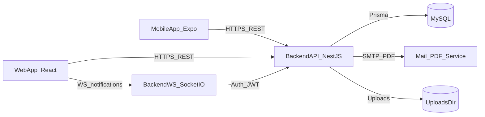

# SIM Tracker — tehnička dokumentacija (BS)

Izvor istine (scope, workflow-i, acceptance): `execution-playbook/SOURCE_OF_TRUTH.md`.

Ovaj dokument je namijenjen **stručnim osobama** (dev/ops/QA) da razumiju arhitekturu, implementaciju i održavanje sistema.

---

## 1. Sistem pregled

Sistem se sastoji od tri aplikacije i jedne baze:

- **Backend**: NestJS + Prisma + MySQL (`backend/`)
- **Web frontend**: Vite + React + Ant Design + Tailwind (`frontend/`)
- **Mobile**: Expo Router + React Native (`mobile/`)
- **DB**: MySQL 8.x (preko Prisma ORM)

**Default URL-ovi (lokalno):**

- Backend API: `http://localhost:3000/api`
- Swagger: `http://localhost:3000/api/docs`
- Frontend: `http://localhost:5173`

---

## 2. Kanonski workflow-i

Kanonski workflow-i su definisani u `execution-playbook/06_WORKFLOWS_AND_ACCEPTANCE.md` i mapirani na implementaciju:

- **WF-01 Excel import**: `POST /api/shipments/:id/import` (preview + apply)
- **WF-02 Scan → Create Record (mobile)**: `GET /api/sim-cards/scan/:iccid` → `POST /api/sim-cards/:id/claim` → `POST /api/installation-records`
- **WF-03 Approve → PDF → Email**: `POST /api/installation-records/:id/approve` → `GET /api/installation-records/:id/pdf` → `POST /api/installation-records/:id/send`

---

## 3. Arhitektura (visoko-nivo)

- **REST API** je autoritativan izvor istine (statusi, read/unread, RBAC).
- **WebSocket** služi za real-time signal (nove notifikacije), uz UI refetch za konzistenciju.
- **PDF i email** su backend odgovornost (klijenti ne generišu finalne dokumente).

---

## 4. Backend (NestJS)

### 4.1 Globalne konvencije

Implementacija je u `backend/src/main.ts`:

- **Global prefix**: `/api`
- **Swagger**: `/api/docs` (Bearer auth)
- **Security**: `helmet()`
- **CORS**: `FRONTEND_URL` (default `http://localhost:5173`)
- **Validacija**: globalni validation pipe (whitelist, transform, forbid non-whitelisted)
- **Response envelope**: uspjeh je u formatu `{ success: true, data: ... }`
- **Exception envelope**: standardizovan shape (prisma i http filter)
- **Interceptors**: logging + timeout + transform
- **WebSockets**: Socket.IO adapter je aktiviran

### 4.2 Moduli i domene

`backend/src/app.module.ts` registruje module (skraćeno po domenama):

- **Auth/Users**: prijava, refresh, logout, profile, promjena lozinke; CRUD korisnika
- **Org scope**: distribucije/podružnice + scope filtering po roli
- **Shipments/SimCards**: isporuke, import SIM, statusi, scan/claim/assign
- **Meters/Records**: brojila, zapisnici (status lifecycle, pdf, timeline, permissions)
- **Recipients/Mail/Notifications/Settings**: recipient grupe, email templating, in-app notifikacije (REST+WS), admin postavke
- **Dashboard/Analytics**: KPI, analitika + CSV export
- **Files/Uploads**: serving fotografija preko zaštićenog endpointa
- **ActivityLog**: audit trail

### 4.3 Auth i sesija (JWT + refresh)

- Access token: `Authorization: Bearer <token>`
- Refresh endpoint: `POST /api/auth/refresh` sa `{ refreshToken }`
- JWT secret-i i expirations dolaze iz env varova (vidi `backend/.env.example`)

### 4.4 RBAC + scope enforcement

Kanonski model (playbook):

- Role: `SYSTEM_ADMIN`, `MODERATOR`, `USER`
- Organizacijski scope: **Distribucija → Podružnica**

Implementacijski obrasci:

- `JwtAuthGuard` + `RolesGuard` + `@Roles(...)`
- `scopeWhere(...)` (prisma where) koji filtrira podatke po roli i scope-u
- “Approver USER” logika kroz membership u approval grupi (`RecipientGroupUser`) + backend enforcement (npr. akcije approve/reject/activate)

### 4.5 Status lifecycle i kritična pravila

Zapisnik (`InstallationRecord`) ima statusni workflow (playbook P3/P4) i endpoint-e:

- `POST /api/installation-records/:id/submit-for-approval`
- `POST /api/installation-records/:id/approve`
- `POST /api/installation-records/:id/reject`
- `POST /api/installation-records/:id/activate-sep`
- `POST /api/installation-records/:id/send` (samo admin/moderator)

Kritična pravila (playbook `03_RULEBOOK.md`):

- Nema slanja email/PDF-a ako zapisnik nije u validnom statusu.
- Import mora validirati duplikate i format ICCID prije upisa.
- Svaka kritična mutacija ostavlja `ActivityLog`.

### 4.6 Excel import pipeline (WF-01)

`POST /api/shipments/:id/import`:

- podržani formati: `.xlsx`, `.xls`, `.csv`
- preview + mapiranje kolona + validacija + apply
- throttling (strožiji limit) jer je operativno osjetljiv endpoint

### 4.7 Upload fotografija i serviranje

- Upload: `POST /api/installation-records/upload-photo` (max 5MB, memory storage; vraća putanju)
- Serving: `GET /api/files/photo?path=installation-records/...` (JWT protected)

**Napomena (runtime path / Docker):** kod koristi `process.cwd()/uploads`, dok Dockerfile koristi `WORKDIR /usr/src/app`, a compose bind-mount je na `/usr/app/uploads`. Ovo treba uskladiti u produkciji (vidi `docs/deploy-guide.bs.md`).

### 4.8 Notifikacije (REST + WS)

WebSocket:

- Namespace: `/notifications`
- Socket.IO path: `/api/socket.io`
- Auth: token u `handshake.auth.token` (verifikacija preko `JWT_SECRET`)

Web UI:

- prima `notification` event i radi invalidaciju/refetch (`react-query`) za unread count i listu.
- fallback je periodični polling za UI konzistenciju (playbook P4 minimalni standard).

Mobile:

- in-app ekran notifikacija (REST) + push kao dodatni kanal sa deep link-om.

### 4.9 Analytics + CSV export (P4.2)

Backend endpointi:

- `GET /api/analytics/overview`
- `GET /api/analytics/sim-cards`
- `GET /api/analytics/installation-records`
- `GET /api/analytics/users`
- `GET /api/analytics/exports/:report.csv`

Svi su scope-aware i rate-limited.

---

## 5. Web frontend (Vite + React + AntD)

### 5.1 Routing i stranice

Router je u `frontend/src/router/index.tsx`.

- Public: `/login`, `/forbidden`, `*`
- Protected (AppLayout): `/dashboard`, `/users`, `/shipments` (+ `/new`, `/:id`), `/meters`, `/sim-cards/:id`, `/installation-records` (+ `/new`, `/:id`), `/recipients`, `/activity-log`, `/settings`, `/analytics`

RBAC na klijentu:

- `ProtectedRoute` (auth)
- `RoleGuard` (role → redirect `/forbidden`)

### 5.2 API layer i token refresh

Axios instance `frontend/src/api/axios.instance.ts`:

- base URL: `VITE_API_BASE_URL` (default `http://localhost:3000/api`)
- request interceptor: dodaje access token
- response interceptor: na 401 pokušava refresh (`/auth/refresh`) i retry

### 5.3 State management

- **React Query**: server state (query/mutation, invalidacije)
- **Zustand**: auth session (persist), tour state i sl.

### 5.4 Notifikacije na web-u

Hook `frontend/src/hooks/useNotificationSocket.ts`:

- socket.io-client, path `/api/socket.io`, namespace `/notifications`
- invalidira query-e nakon eventa

---

## 6. Mobile (Expo Router)

### 6.1 Navigacija (expo-router)

Root: `mobile/app/_layout.tsx` (QueryClientProvider + auth hydration).

Route grupa:

- `/(auth)/login`
- `/(app)/(tabs)`:
  - `home`, `scan`, `records`, `demount`, `profile`
- stack-only:
  - `scan-result`, `create-record`, `record-details`, `notifications`

### 6.2 Secure session + refresh

- Session je perzistirana u `expo-secure-store`.
- Axios instance (mobile) radi token attach + refresh/401 retry.

### 6.3 Kamera, lokacija, fotografije, push

- **Barcode scan**: `expo-camera` (`scan` tab)
- **GPS**: `expo-location` (create record)
- **Photo**: `expo-image-picker` + upload na backend
- **Push**: Expo push tokeni + deep link ponašanje (playbook P4)

### 6.4 Offline queue (P5)

`mobile/src/api/installation-records.api.ts`:

- pending create payload-i se čuvaju u SecureStore
- `syncOfflineInstallationRecords()` pokušava poslati queue; ako je offline, prekida rano i ostavlja ostatak

---

## 7. Env varovi (sažetak)

Backend (`backend/.env.example`):

- DB: `DATABASE_URL`
- JWT: `JWT_SECRET`, `JWT_EXPIRATION`, `JWT_REFRESH_SECRET`, `JWT_REFRESH_EXPIRATION`
- App: `PORT`, `FRONTEND_URL`
- Security: `THROTTLE_TTL`, `THROTTLE_LIMIT`, `BCRYPT_SALT_ROUNDS`
- SMTP: `SMTP_HOST`, `SMTP_PORT`, `SMTP_SECURE`, `SMTP_USER`, `SMTP_PASS`, `SMTP_FROM`
- Seed: `ADMIN_EMAIL`, `ADMIN_PASSWORD`, `ADMIN_FIRST_NAME`, `ADMIN_LAST_NAME`

Frontend (`frontend/.env.example`):

- `VITE_API_BASE_URL`

Mobile (`mobile/.env.example`):

- `EXPO_PUBLIC_API_BASE_URL`

---

## 8. Veza sa fazama (P1–P5)

- **P1**: auth, RBAC osnova, users
- **P2**: shipments + excel import + SIM scan/claim
- **P3**: meters + installation records + PDF
- **P3.5**: organizaciona hijerarhija + scope filtering
- **P4**: recipients + email + (REST+WS) notifikacije + dashboard + settings + timeline
- **P4.1**: app tour (web) + mini tips (mobile)
- **P4.2**: analytics + CSV export
- **P5**: polish, test, deploy, offline queue stabilizacija

